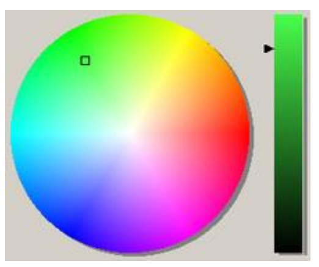

# Fundamentals of robotics

Репозиторий для домашних работы по предмету "Основы робототехники, ч.2". Мустафин Максим

# Homework 1 &#10003;

Tasks:
1) Divide an image in patches and saves them to the disk as a patch with series names

2) Warp an image with a mouse clicking and rotate it with a perspective transformation

3) Record a video from a webcam with OpenCV and save it to the disk with mp4 compression

# Homework 2 &#10003;

Tasks:

1) Use the city map image to annotate it by clicking on the starting point of the route, intermediate points
to be connected with lines in order to indicate the route along the streets to reach the end point 

2) Create a bird's eye view video from a fixed camera using perspective transformation and save it to a file

3) Annotate a video fragment with text and save the annotated video to a file

# Homework 3 &#10003;

Tasks:
1) For HSV color model, build a circle with Hue & Saturation channels, and an additional bar with adjusting slider for Value
channel

2) Make a possibility to choose a point in circle by using a mouse button

3) Invert the selected color point to RGB, LAB and YCrCb colors, and output the computed values in a window

# Homework 4 &#10003;

Tasks:
1) Corrupt an image with salt-and-pepper noise (using adjustable proportions for salt-and-pepper noise, e.g. from 10 to 90%)

2) Filter the image with Averaging, Median, Gaussian blur, and Bilateral Filtering using OpenCV, and compare the result images 

# Homework 5 &#10003;

Tasks:
1) Corrupt an image with a noise (salt-pepper, etc.) (using an adjusting slider to change the noise propotions, e.g. from 10 to 90%)

2) Filter the image with Frequency Filtering (Mean Filter, Gaussian, etc.) using Numpy and OpenCV, and compare the result
images with relevant convolution filters

3) Find the edges with Frequency Filters (Laplacian, Sobel X and Y, Sharr X and Y) using Numpy / OpenCV, and compare the
result images with the relevant convolution filters 

# Homework 6 &#10003;

Tasks:
1) Add cannyEdgeDetection to image which is used with Sobel in Homework 5.

# Homework 7 &#10003;

Tasks:
1) Take an image that has a closed object (rectangle, ball, smartphone), detect its contours using the findContours commands, and by selecting the contour of the object, enlarge this object using trackbar.

# Homework 8 &#10003;

Tasks:
1) Take/print a chessboard and record a dataset with some photos of different positions relatively to a camera (a camera with
switched off auto-focusing mode); Calibrate the camera using Numpy and OpenCV and store the intrinsic and extrinsic
parameters.

2) Place a round flat object (e.g. a coin) on the checkerboard, take a photo and use filters and edge detectors (Canny/Sobel,
blurring, dilatation and erosion) to get the clear object’s boundaries. Estimate the object’s dimensions, and check it by a ruler.
Compute the distance between the camera plane and the selected object.

3) Place a rectangular flat object (e.g. a card/magnet) on the checkerboard, take a photo and use corner detectors (Shi-Tomasi
and Harris) to get the clear object’s corners (with SubPixel Accuracy) and estimate the object’s dimensions (compare it with a
ruler measurements). Compute the distance between the camera plane and the selected object.

# Homework 9 &#10003;

https://www.youtube.com/watch?v=7gSWd2hodFU&list=PLMoSUbG1Q_r-JNMQ0zJmv6SnXwgbA8JJp&index=2

# Homework 10

1) Build a stereo pair with a couple of smartphones/webcams (switching off the autofocusing mode), and calibrate it using a
checkerboard & OpenCV Python. When recording the images, use static poses of the checkerboard (if there is no time
synchronization between cameras).

2) Place yourself (and other guys) in a scene in front of the stereo pair, and take an image dataset (from left & right cameras).

3) Detect humans using YOLOv5, OpenCV Python and the images from one of the camera.

4) Compute the disparity map of the scene using OpenCV Python.

5) Estimate the distance to the humans in the image using the depth information.

